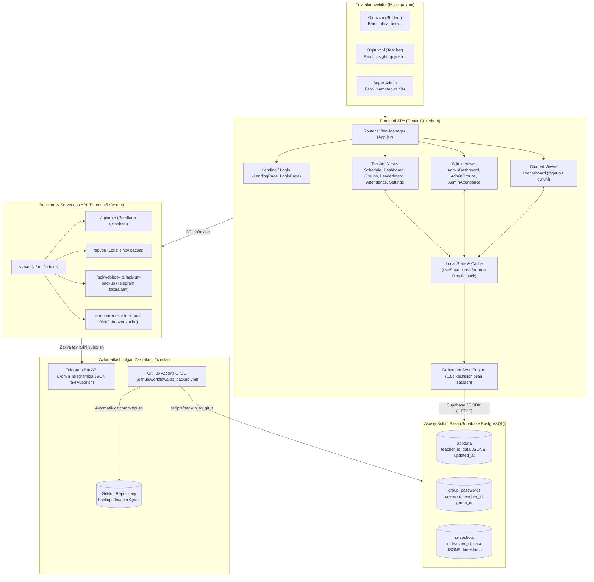
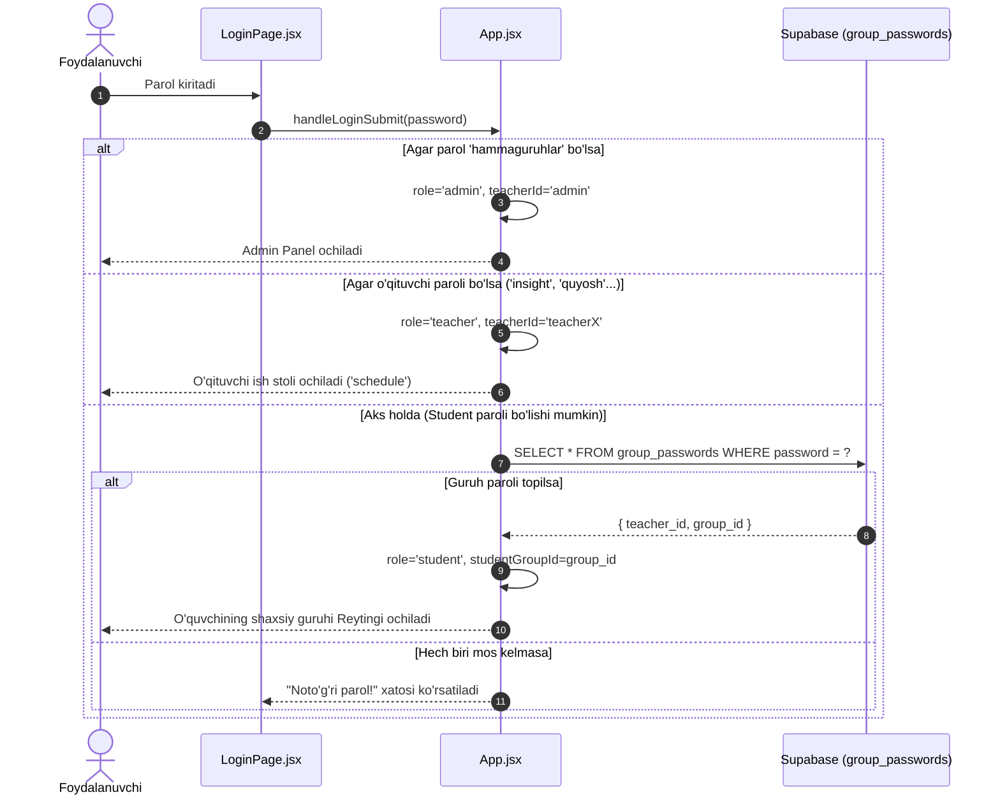
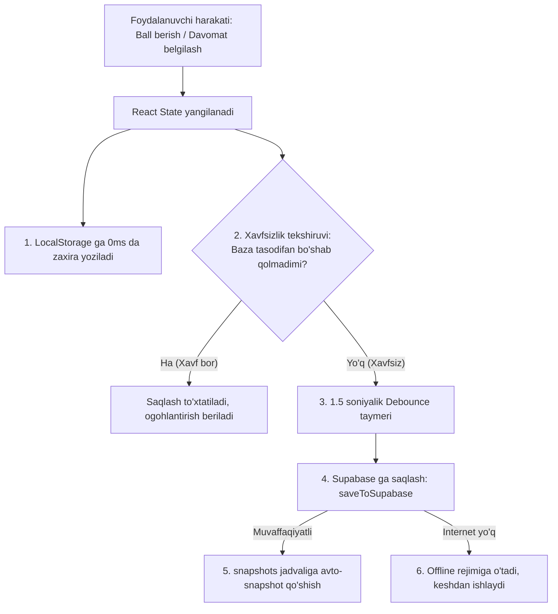
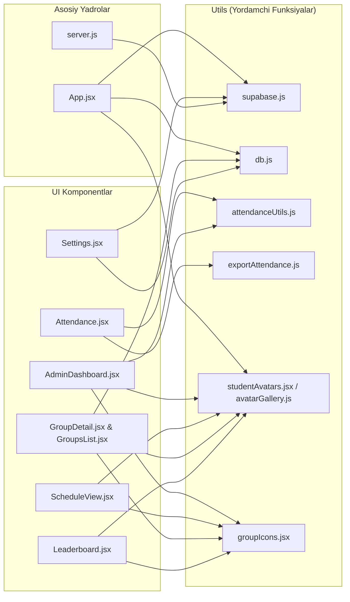

# "Epchil Robot: Rated Student App" — To'liq Tizim Arxitekturasi

Ushbu hujjat **"Epchil Robot: Rated Student App"** platformasining butun dasturiy arxitekturasi, ma'lumotlar oqimi, xavfsizlik modeli, biznes mantiq algoritmlari va papka/fayllar strukturasini to'liq tavsiflaydi.

---

## 1. Loyiha Haqida Umumiy Tushuncha

**"Epchil Robot: Rated Student App"** — o'quv markazlari va robototexnika to'garaklari uchun mo'ljallangan talabalar reytingi (gamifikatsiya), davomat nazorati va dars jadvalini boshqaruvchi ko'p foydalanuvchili (Multi-tenant) bulutli tizimdir.

Platforma **3 xil turdagi foydalanuvchilar** uchun xizmat qiladi:
1. **Super Admin** (`admin`) — barcha 4 ta o'qituvchi ma'lumotlari, umumiy statistika va davomatni bir joydan nazorat qiladi.
2. **O'qituvchi** (`teacher`) — o'z guruhlari, talabalari, dars jadvallari, ball/likelar berish va davomat jurnallarini mustaqil boshqaradi.
3. **O'quvchi** (`student`) — o'z guruhiga tegishli maxsus o'zbekcha so'z-parol (masalan: `olma`, `anor`) orqali kirib, faqat o'z guruhining reyting jadvali va ballar tarixini ko'radi (boshqa guruhlar ma'lumotlaridan to'liq izolyatsiya qilingan).

---

## 2. Tizimning Global Arxitekturasi (High-Level Architecture)



---

## 3. Foydalanuvchi Rollari va Avtorizatsiya Modeli (RBAC & Auth Flow)

Tizimda an'anaviy `email/login` tizimi o'rniga, bolalar va o'qituvchilar uchun qulay bo'lgan **yagona parolli (Password-Only RBAC)** tizim joriy qilingan.

| Rol | Parol misollari | Huquqlari | Ko'radigan bo'limlari |
| :--- | :--- | :--- | :--- |
| **Super Admin** | `hammaguruhlar` | Barcha 4 o'qituvchining ma'lumotlarini o'qish, solishtirish, umumiy monitoring | `AdminDashboard`, `AdminGroups`, `AdminAttendance` |
| **O'qituvchi 1** | `insight`, `beksila` | Faqat `teacher1` bazasini to'liq boshqarish (yozish/o'chirish) | Dars jadvali, Dashboard, Guruhlar, Reyting, Davomat, Sozlamalar |
| **O'qituvchi 2** | `quyosh` | Faqat `teacher2` bazasini to'liq boshqarish | Barcha o'qituvchi bo'limlari |
| **O'qituvchi 3** | `hehehe` | Faqat `teacher3` bazasini to'liq boshqarish | Barcha o'qituvchi bo'limlari |
| **O'qituvchi 4** | `simsim` | Faqat `teacher4` bazasini to'liq boshqarish | Barcha o'qituvchi bo'limlari |
| **O'quvchi** | O'zbekcha so'z: `olma`, `anor`, `sher`... | Faqat o'z guruhining natijalarini ko'rish (Read-Only) | Faqat `Leaderboard` (o'z guruhi doirasida) |

### Autentifikatsiya Ketma-ketligi:



---

## 4. Ma'lumotlar Tuzilishi va Baza Arxitekturasi (Database Schema)

Tizim PostgreSQL ustida qurilgan bo'lib, yuqori tezlik va moslashuvchanlik uchun **Hybrid JSONB Document Store** yondashuvidan foydalanadi.

### 4.1. Supabase Jadvallari:

1. **`appdata`** jadvali (O'qituvchilarning asosiy bazasi):
   - `teacher_id` (`TEXT`, Primary Key) — `teacher1`, `teacher2`, `teacher3`, `teacher4`.
   - `data` (`JSONB`, NOT NULL) — O'qituvchining barcha guruhlari, talabalari, tranzaksiyalari va davomatlari jamlangan ob'ekt.
   - `updated_at` (`TIMESTAMPTZ`) — Oxirgi tahrirlangan vaqt.

2. **`group_passwords`** jadvali (Guruh parollari global reestri):
   - `password` (`TEXT`, Primary Key) — Kichik harflardagi o'zbekcha so'z (masalan: `uzum`).
   - `teacher_id` (`TEXT`, NOT NULL) — Guruh qaysi o'qituvchiga tegishliligi.
   - `group_id` (`TEXT`, NOT NULL) — Ichki guruh identifikatori.

3. **`snapshots`** jadvali (Orqaga qaytarish - Rollback nuqtalari):
   - `id` (`SERIAL`, Primary Key).
   - `teacher_id` (`TEXT`).
   - `data` (`JSONB`) — O'sha paytdagi butun holat nusxasi (maksimal oxirgi 5 ta snapshot saqlanadi).
   - `timestamp` (`TIMESTAMPTZ`).

---

### 4.2. `appdata.data` (JSONB) Ichki Tuzilmasi

```json
{
  "groups": [
    {
      "id": "abc123xyz",
      "name": "Robo-Start 1",
      "icon": "robot",
      "password": "olma",
      "color": "#007AFF",
      "schedule": {
        "days": ["mon", "wed", "fri"],
        "startTime": "15:30",
        "endTime": "17:00",
        "room": "Xona 204"
      },
      "createdAt": "2026-09-01T10:00:00.000Z",
      "deleted": false,
      "deletedAt": null
    }
  ],
  "students": [
    {
      "id": "st9876543",
      "name": "Ali Valiyev",
      "groupId": "abc123xyz",
      "emoji": "lion",
      "color": "#34C759",
      "createdAt": "2026-09-01T10:05:00.000Z",
      "joinedGroupAt": "2026-09-01T10:05:00.000Z",
      "groupHistory": [
        {
          "groupId": "old_group_id",
          "joinedAt": "2026-08-01T00:00:00.000Z",
          "leftAt": "2026-09-01T10:05:00.000Z"
        }
      ],
      "deleted": false,
      "deletedAt": null
    }
  ],
  "transactions": [
    {
      "id": "tx_456789",
      "studentId": "st9876543",
      "amount": 85,
      "comment": "Uy vazifasi bajarildi 📚",
      "timestamp": "2026-09-11T12:30:00.000Z",
      "deleted": false
    }
  ],
  "attendance": [
    {
      "id": "att_001122",
      "groupId": "abc123xyz",
      "date": "2026-09-11",
      "records": {
        "st9876543": "present"
      },
      "createdAt": "2026-09-11T15:35:00.000Z",
      "updatedAt": "2026-09-11T15:40:00.000Z"
    }
  ],
  "quickTags": [
    { "text": "Uy vazifasi bajarildi 📚", "points": 85 },
    { "text": "Mustaqil izlanish 🔍", "points": 50 },
    { "text": "Darsga kechikdi ⏰", "points": -10 }
  ]
}
```

> **Soft-Delete (Yumshoq o'chirish) mexanizmi:**
> Guruh yoki talaba o'chirilganda bazadan butunlay o'chib ketmaydi, balki `deleted: true` belgisi qo'yiladi. Bu orqali Sozlamalar bo'limidagi **"Chiqindilar qutisi" (Trash Bin)** orqali tasodifan o'chirilgan ma'lumotlarni 1 ta tugma bilan asliga qaytarish (Restore) mumkin.

---

## 5. Ma'lumotlarni Saqlash va Sinxronizatsiya Mantig'i



1. **Debounced Cloud Sync (1.5s):** Har bir bosilgan tugma uchun darhol serverga so'rov ketmaydi. Oxirgi o'zgarishdan keyin 1.5 soniya kutib, butun o'zgarish bitta paketda Supabase'ga yuboriladi.
2. **Accidental Wipeout Guard (Tasodifiy o'chib ketishdan himoya):** Agar brauzerda guruhlar yoki talabalar soni 0 bo'lib qolsa, lekin oldingi saqlangan bazada ma'lumotlar bo'lgan bo'lsa, tizim bulutdagi bazani bo'sh ma'lumot bilan yozib yuborishni (overwrite) avtomatik bloklaydi.
3. **Disaster Recovery (Offline himoya):** Internet uzilib qolsa, sahifa yangilanganda ham ma'lumotlar yo'qolmaydi, balki `rsa_local_backup_${teacherId}` lokal keshidan tiklanadi.

---

## 6. Matematik va Biznes Mantiq Algoritmlari

### 1. Bayesian Fair Attendance Score (Adolatli Davomat Baholash)
Oddiy foiz hisobida 1 ta darsga kelib 100% bo'lgan o'quvchi, 20 ta darsdan 19 tasiga kelgan (95%) tirishqoq o'quvchidan yuqori o'ringa chiqib ketadi (Simpson paradoksi). Buni oldini olish uchun `attendanceUtils.js` faylida Bayes silliqlash algoritmi qo'llanilgan:

$$\text{FairScore} = \frac{\text{Present} + (\text{Late} \times 0.5) + (K \times \text{Prior})}{\text{AccountableLessons} + K} \times 100$$
*(Bu yerda $K = 3$, Boshlang'ich kutilma $\text{Prior} = 0.70$)*

### 2. Guruh Parollari Generatori
`db.js` faylidagi `generateUniqueGroupPassword()` funksiyasi 90 ga yaqin sodda o'zbekcha so'zlar (`olma`, `anor`, `sher`, `kitob`...) reestridan foydalanadi va Supabase'dagi barcha olingan parollarni tekshirib, takrorlanmaydigan parol generatsiya qiladi.

### 3. Natural Sorting (Tabiiy Saralash)
Guruhlar ro'yxati (G1, G2, G10) oddiy matnli saralashda `G1, G10, G2` bo'lib buzilmasligi uchun `localeCompare(..., { numeric: true })` orqali tabiiy tartibda saralanadi.

---

## 7. Zaxiralash (Backup) Tizimining 4 Pog'onali Arxitekturasi

1. **Lokal Brauzer Kesh Zaxirasi:** Har bir tahrirda `localStorage`ga avto-saqlanadi.
2. **Supabase Snapshots (Orqaga qaytarish):** O'qituvchi oxirgi 5 ta tahrir nuqtasining istalganiga 1 bosish bilan tizimni qaytara oladi (`Settings.jsx` orqali).
3. **Telegram Bot Avto-Zaxira:** 
   - Har kuni Toshkent vaqti bilan tonggi 06:00 da `node-cron` va Vercel Cron ishga tushadi.
   - 4 ta o'qituvchining barcha ma'lumotlari `.json` fayl qilib Telegramdagi Administrator lichkasiga jo'natiladi.
   - Admin xohlagan paytda Telegram botga `/backup` buyrug'ini yozib, bazaning yangi nusxasini fayl ko'rinishida olishi mumkin.
4. **GitHub Repozitoriy Zaxirasi (Git-as-a-Backup):**
   - `.github/workflows/db_backup.yml` orqali har kuni GitHub Actions ishga tushadi.
   - `scripts/backup_to_git.js` orqali Supabase'dagi ma'lumotlarni tortib olib, `backups/` papkasiga yozadi va avtomatik ravishda Git commit va push qiladi.

---

## 8. Loyihaning To'liq Folder (Papka) va Fayllar Strukturasi

```
ratedStudentApp/
├── .github/
│   └── workflows/
│       └── db_backup.yml            # Har kuni avtomatik ravishda Supabase bazasini gitga commit qiluvchi GitHub Actions workflow
│
├── api/
│   └── index.js                     # Vercel serverless platformasi uchun backend kirish nuqtasi (server.js ni eksport qiladi)
│
├── backups/                         # GitHub Actions orqali saqlanadigan o'qituvchilarning kundalik JSON nusxalari
│   ├── teacher1.json
│   ├── teacher2.json
│   ├── teacher3.json
│   └── teacher4.json
│
├── public/                          # Brauzer uchun ochiq statik aktivlar
│   ├── favicon.ico / favicon.svg    # Sayt ikonkasi
│   ├── site.webmanifest             # PWA (Progressive Web App) sozlamalari
│   ├── screens/                     # Landing sahifasidagi slaydlar uchun skrinshot rasmlari
│   └── avatar_image/                # O'quvchilar va guruhlar uchun 3D avatarlar to'plami
│
├── scripts/
│   └── backup_to_git.js             # Supabase dan 4 ta o'qituvchi ma'lumotlarini yuklab backups/ papkasiga yozuvchi skript
│
├── storage/
│   └── db.json                      # Mahalliy ishlab chiqish (offline/local Express) uchun zaxira JSON fayl
│
├── src/                             # ASOSIY FRONTEND KODI
│   ├── assets/                      # Ichki SVG va rasmlar (hero.png, react.svg...)
│   │
│   ├── components/                  # Asosiy React komponentlari (UI Ekranlar)
│   │   ├── admin/                   # Super Admin uchun maxsus boshqaruv paneli
│   │   │   ├── AdminDashboard.jsx   # Barcha 4 o'qituvchi bo'yicha jamlangan statistika, reytinglar va jadvallar
│   │   │   ├── AdminGroups.jsx      # Barcha o'qituvchilarning guruhlarini umumiy ro'yxatda filtrlash
│   │   │   └── AdminAttendance.jsx  # Markaz bo'yicha umumiy davomat tahlili va ko'rsatkichlari
│   │   │
│   │   ├── Attendance.jsx           # O'qituvchining dars davomati jurnali (kunlik belgilash, oylik matritsa, statistika)
│   │   ├── Dashboard.jsx            # O'qituvchi Bosh sahifasi (Umumiy likelar, top o'quvchilar, statistikalar)
│   │   ├── GroupDetail.jsx          # Guruhning ichki oynasi (O'quvchilar ro'yxati, ball qo'yish modal oynasi, ko'chirish)
│   │   ├── GroupsList.jsx           # Guruhlar kartochkalari, yangi guruh ochish, tahrirlash, parol berish
│   │   ├── History.jsx              # Ballar berilishi tarixi va loglari (auditorlik jurnali)
│   │   ├── LandingPage.jsx          # Tizimga kirmaganlar uchun taqdimot sahifasi (Apple uslubidagi zamonaviy UI)
│   │   ├── Leaderboard.jsx          # Gamifikatsiyalangan Reyting doskasi (Top-3 podium, oylik/kurs davomidagi saralash)
│   │   ├── LoginPage.jsx            # Tizimga yagona parol orqali kirish oynasi
│   │   ├── ScheduleView.jsx         # Interaktiv haftalik dars jadvali (Dushanba-Shanba dars soatlari va xonalar)
│   │   ├── Settings.jsx             # Tizim sozlamalari (Teglar, ball qiymatlari, zaxira nusxalari, Chiqindilar qutisi)
│   │   ├── Sidebar.jsx              # Navigatsiya menyusi (Desktop yuqori bar + Mobil pastki tabbar)
│   │   └── Time24Input.jsx          # Dars soatini tanlash uchun qulay 24-soatlik maxsus vaqt kirituvchi komponent
│   │
│   ├── utils/                       # Yordamchi biznes-mantiq va servis funksiyalari
│   │   ├── attendanceUtils.js       # Davomat hisoblash, Bayesian Fair Score, guruh o'zgarish sanalarini hisobga olish
│   │   ├── avatarGallery.js         # Avatarlar ro'yxati va ularning URL manzillarini normallashtirish
│   │   ├── db.js                    # Pok (Pure) funksiyalar: guruh/o'quvchi/ball qo'shish, o'chirish, o'zbekcha parol generatori
│   │   ├── exportAttendance.js      # Davomat jurnalini Excel (CSV UTF-8 BOM) va PDF (Print) formatida yuklab beruvchi modul
│   │   ├── firebase.js              # Firebase Firestore mijozi (eski bazadan ko'chirish va zaxira varianti)
│   │   ├── groupIcons.jsx           # Guruhlar uchun rang-barang SVG va 3D ikonkalar render moduli
│   │   ├── studentAvatars.jsx       # O'quvchilar uchun jonli kulgichlar (emoji) va avatarlar render moduli
│   │   └── supabase.js              # Asosiy Supabase mijozi (CRUD, snapshotlar, parollar reestri, admin yuklamasi)
│   │
│   ├── App.css                      # Apple Design System uslubidagi umumiy klasslar va dizayn qoidalari
│   ├── App.jsx                      # Ilovaning yuragi: State menejer, Router, Cloud sinxronizator, Toastlar
│   ├── index.css                    # Tailwind / Global CSS o'zgaruvchilari (Dark/Light mavzu ranglari)
│   └── main.jsx                     # React DOM ga ilovani StrictMode da render qiluvchi boshlang'ich fayl
│
├── arch.md                          # Loyihaning to'liq arxitektura hujjati
├── index.html                       # HTML asosiy hujjati, shriftlar va meta teglar
├── package.json                     # Loyiha paketlari va npm buyruqlari
├── server.js                        # Node.js Express serveri (Telegram Bot, Supabase migratsiya, Cron, Webhooklar)
├── vercel.json                      # Vercel serverless va cron sozlamalari
└── vite.config.js                   # Vite sozlamalari (@vitejs/plugin-react bilan)
```

---

## 9. Asosiy Fayllarning Ichki Bog'liqligi (Dependency Flow)



---

## 10. Xulosa va Arxitektura Bahosi

* **Zero Latency UX:** Ma'lumotlar avval mahalliy xotirada darhol aks etadi, so'ngra fonda sinxronlashadi — foydalanuvchi hech qanday qotishni sezmaydi.
* **Multi-Tenancy & Privacy:** O'qituvchilar bir-birining guruhini ko'rmaydi, talabalar esa faqat o'z guruhini ko'radi.
* **Tugallangan Backup tizimi:** Telegram, GitHub Actions, Supabase Snapshot va LocalStorage orqali 4 karra himoyalangan.
* **Adolatli reyting matematikasi:** Kichik guruhlar va yangi qo'shilgan talabalar eski talabalar bilan adolatli musobaqalasha oladi.
